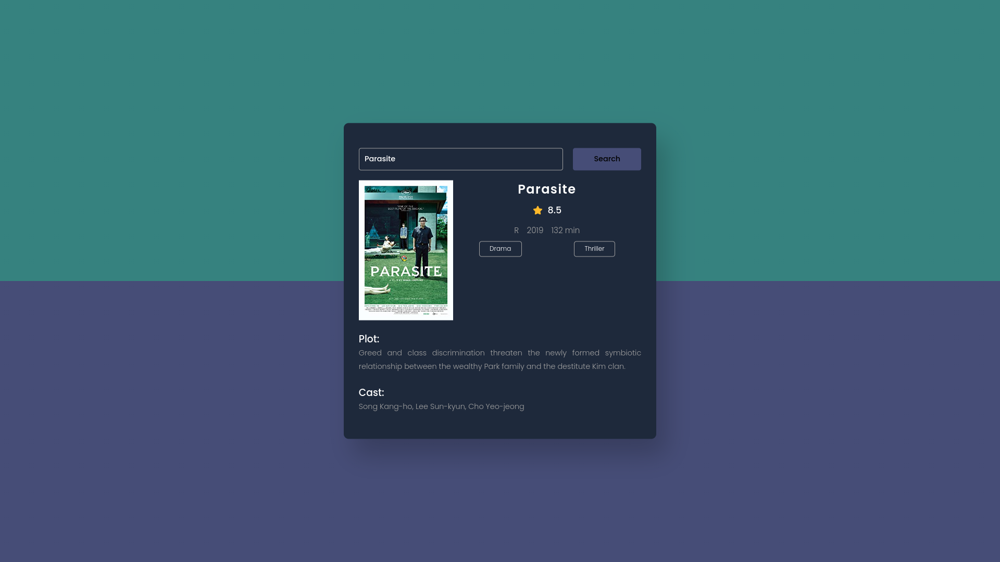

Of course! I'd be happy to help you create a professional README/documentation for your movie guide app. A good README should provide clear and concise instructions on how to use your app, what technologies it utilizes, and any necessary setup steps. Below is a template you can use as a starting point for your documentation:

# Movie Guide App



## Description

The Movie Guide App is a web application that allows users to search for movies and get detailed information about them, including ratings, cast, plot, and more. It utilizes the [Movies Database API](https://www.moviesdatabaseapi.com) to fetch movie data and presents it in an easy-to-navigate and visually appealing interface.

## Features

- Search for movies by title or keywords.
- View detailed information about each movie, including ratings, release year, runtime, genre, and plot.
- Discover the cast and crew of each movie.
- Save favorite movies to a personal watchlist.

## Demo

[Link to the live demo](https://your-movie-guide-app.com)

## Technologies Used

- HTML
- CSS
- JavaScript (ES6+)
- [Movies Database API](https://www.moviesdatabaseapi.com)

## Installation

1. Clone the repository:

```bash
git clone https://github.com/AymanSdk/Movies-Guide_app.git
```

2. Navigate to the project folder:

```bash
cd Movies-Guide_app
```

3. Open the `index.html` file in your preferred web browser.

## API Key Setup

To run the app locally, you need to obtain an API key from the Movies Database API. Follow these steps:

1. Visit [Movies Database API](https://www.moviesdatabaseapi.com) and sign up for an account.

2. Once you have your API key, create a new file named `config.js` in the root of the project.

3. In `config.js`, add the following code:

```js
const API_KEY = 'YOUR_API_KEY_HERE';
```

4. Replace `'YOUR_API_KEY_HERE'` with your actual API key.

5. Save the `config.js` file.

## Usage

- Enter the movie title or keywords in the search bar and click "Search" to retrieve a list of matching movies.
- Click on a movie from the search results to view detailed information about it.
- To add a movie to your watchlist, click the "Add to Watchlist" button on the movie details page.
- To remove a movie from your watchlist, click the "Remove from Watchlist" button on the movie details page.

## Contributing

Contributions are welcome! If you find any issues or have suggestions for improvement, please open an issue or submit a pull request to this repository.

## License

[MIT License](LICENSE)

## Contact

For any inquiries or questions, feel free to contact me at your-email@example.com.

---

With this README, users and potential contributors will have a clear understanding of what your app does, how to use it, and how to set it up for local development. Make sure to replace the placeholders with actual information and customize the sections as needed to accurately reflect your movie guide app. Good luck with your project!